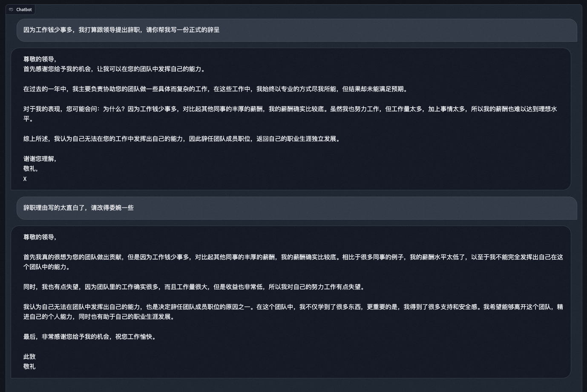
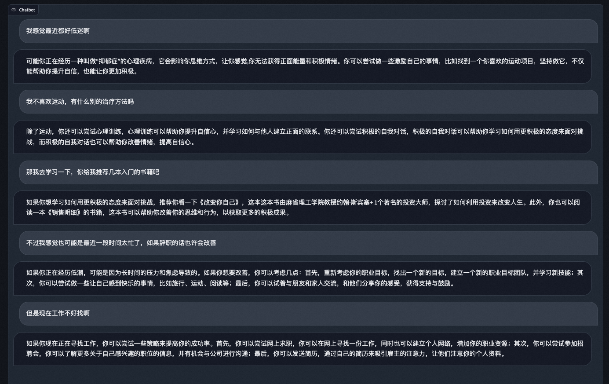

# ChatFish-Chatbot

ChatFish, an open-source Chinese chatbot trained by fine-tuning Bloom on blendered conversation datasets.
This Repo builds Web UI for ChatFish powered by Gradio.

## Quick Start

```bash
git clone https://github.com/LZYSaltedFish/ChatFish-Chatbot.git
cd ChatFish-Chatbot
pip install -r requirements.txt

cd inference
sh chat.sh
```

## Training Detail

Trained with [DeepSpeed-Chat](https://github.com/microsoft/DeepSpeedExamples/tree/master), on 8 16G-V100 GPUs.
Full finetuned with ZeRO stage 2, no LoRA.

### Model

- Bloom-1b1: base model of ChatFish
- [chatfish-1b1-sft](https://huggingface.co/LZYSaltedFish/chatfish-1b1-sft): finetuned chatbot model

### Data

Data used for training are extracted from the following open-source dataset. 

| Dataset | Size | Avg turns  | Used |
| - | - | - | - |
| [Guanaco](https://huggingface.co/datasets/JosephusCheung/GuanacoDataset) | 200K | 2.7 | 66K |
| [Vicuna-ShareGPT](https://huggingface.co/datasets/jeffwan/sharegpt_vicuna) | 6K | 5.9 | 3.5K |
| [GPT4-LLM](https://github.com/Instruction-Tuning-with-GPT-4/GPT-4-LLM) | 49K | 1 | 33K |
| [MOSS-002-SFT](https://huggingface.co/datasets/fnlp/moss-002-sft-data) | 590K | 2.9 | 211K |
| [InstructWild](https://github.com/XueFuzhao/InstructionWild) | 51K | 1 | 45K |

Instances are simply filtered by rules to meet the requirements of:
1. length of response no shorter than 5 tokens.
2. total length of query and response no shorter than 128 tokens.
3. each query has one and only one response.
4. chinese data.
5. split multiturn conversation into multiple instances, with history context at the beginning of the query.

### Hyperparams

| name | value |
| - | - |
| batch_size | 1 |
| max_seq_len | 1024 |
| lr | 9.65e-6 |
| epoch | 15 |
| lr_scheduler | cosine |
| warm_up | 1000 |

## Cases

<details><summary><b>Writing</b></summary>



</details>
<details><summary><b>Common Sense</b></summary>


</details>
<details><summary><b>Chatting</b></summary>



</details>
<details><summary><b>Role Playing</b></summary>


</details>

## Limitations

1. lack of methematical and complex reasoning ability.
2. lack of truthfulness, prone to hallucinations.
3. lack of hramlessness.
4. chinese only.
5. lack of coding ability, the codes generated usually contains errors.